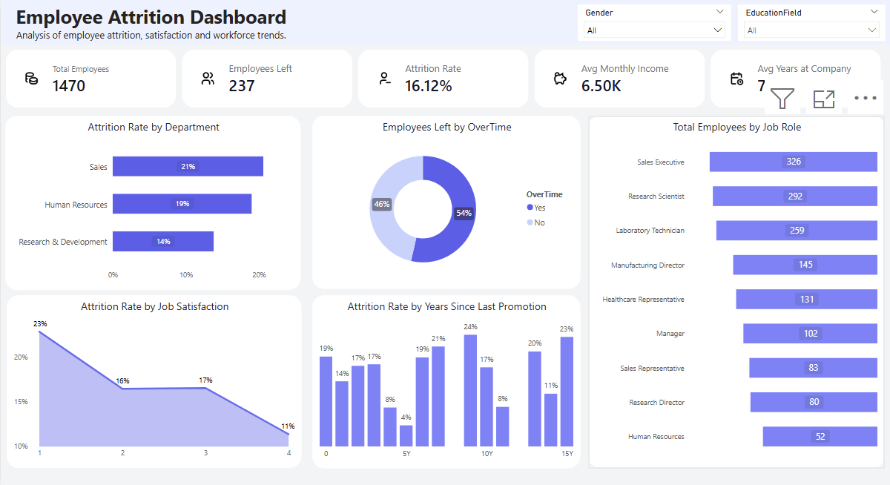

# HR Attrition Analysis – SQL & Power BI

## Project Overview
The project focuses on analyzing employee attrition and workforce trends using SQL and Power BI.

The analysis includes:
- employee attrition rate by department,
- job satisfaction analysis,
- overtime impact on attrition,
- employee demographics,
- KPI metrics and HR dashboards.

## Tools Used
- SQL
- Power BI
- DAX
- Excel
- Power Query

## Files
- `Analiza_rotacji_pracownikow_HR_Agata_Rybicka.pdf` – full project report
- `HR_Attrition_Dashboard.pbix` – Power BI dashboard
- `Dashboard.png` – dashboard preview

## Dashboard Preview

